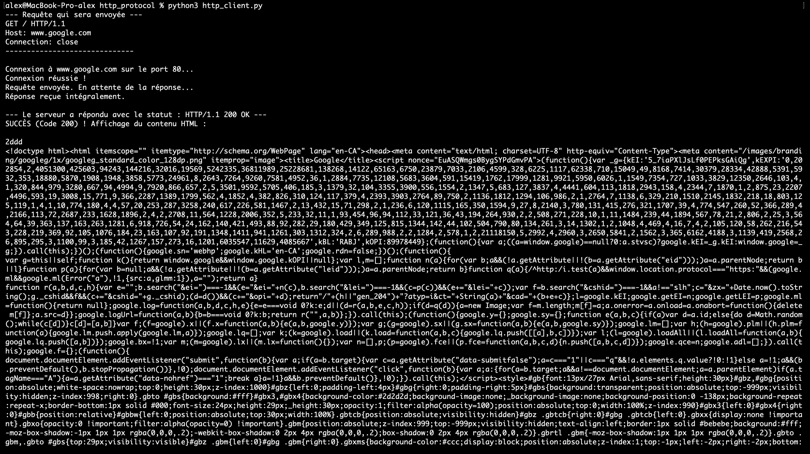
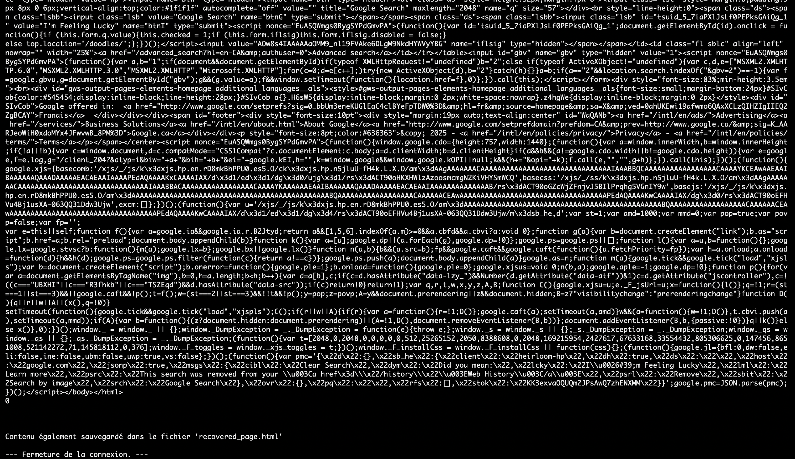
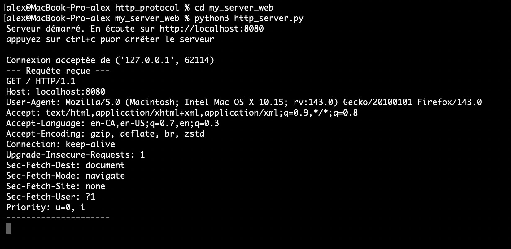
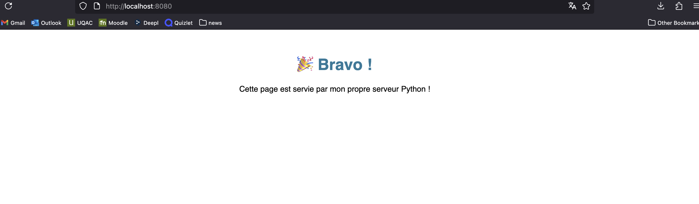

# Client et Serveur HTTP en Python

Exercice de TP universitaire pour implémenter un client HTTP simple et un serveur web de base en utilisant la bibliothèque `socket` de Python.

---

## 1. client HTTP (`http_client.py`)

Ce script agit comme un mini-navigateur en ligne de commande. Il se connecte à un serveur web, demande une page, et affiche la réponse HTML brute dans le terminal tout en la sauvegardant dans un fichier.

### Manuel d'utilisation

* **Prérequis :** Python 3.
* **Lancement :** Pour lancer le programme, ouvrez un terminal dans le dossier du projet et exécutez la commande :
    ```bash
    python3 http_client.py
    ```
* **Configuration :** Pour changer le serveur cible ou la page demandée, modifiez les variables `serveur_cible` et `fichier_demande` directement au début du script.

### Scénario d'exécution

Voici une trace de l'exécution du client se connectant avec succès à `www.google.com`.

**Commande :**
```bash
python3 http_client.py
```

**Sortie du Terminal :**




---

## 2. Serveur HTTP (`http_server.py`)

Ce script est un serveur web de base qui écoute les connexions entrantes sur le port 8080. Il est capable de servir le fichier `index.html` local et de renvoyer une erreur 404 pour tout autre fichier demandé.

### Manuel d'utilisation

* **Prérequis :** Python 3.
* **Préparation :** Un fichier nommé `index.html` doit impérativement être présent dans le même dossier que le script pour que le serveur puisse le trouver et l'envoyer.
* **Lancement :** Pour démarrer le serveur, exécutez la commande suivante dans un terminal :
    ```bash
    python3 http_server.py
    ```
* **test :** Une fois le serveur lancé, ouvrez un navigateur web (Chrome, Firefox, Safari, etc.) et visitez l'adresse `http://localhost:8080`.
* **Arrêt :** Pour arrêter le serveur, retournez au terminal où il est en cours d'exécution et appuyez sur les touches **`Ctrl + C`**.

### scénario d'exécution 

Voici la sortie du serveur lors de son démarrage et de la connexion d'un navigateur web.

**Commande :**
```bash
python3 http_server.py
```

**Sortie du terminal du serveur :**




**résultat dans le navigateur :**

Le navigateur à l'adresse `http://localhost:8080` affiche avec succès le contenu du fichier `index.html`.